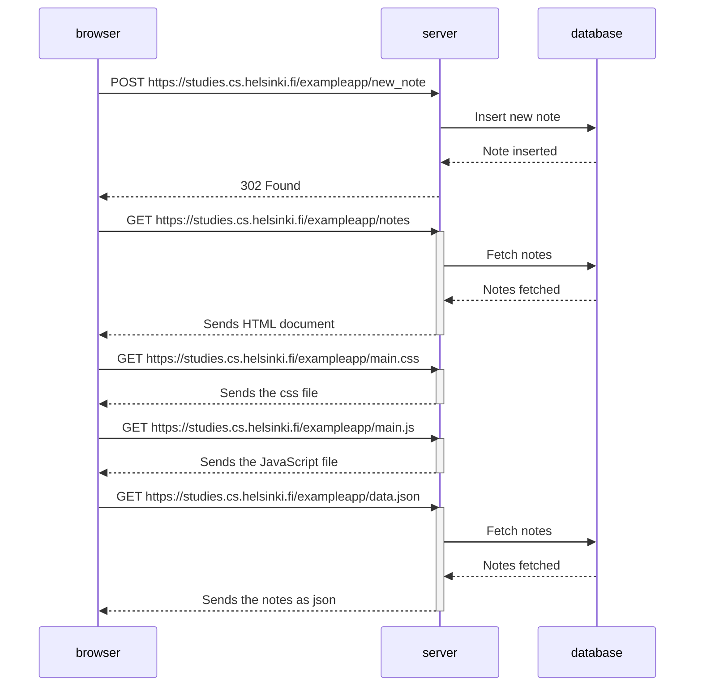

```mermaid
sequenceDiagram
    participant browser
    participant server
    participant database

    browser->>server: POST https://studies.cs.helsinki.fi/exampleapp/new_note
    server->>database: Insert new note
    database-->>server: Note inserted
    server-->>browser: 302 Found

    browser->>server: GET https://studies.cs.helsinki.fi/exampleapp/notes
    activate server
    server->>database: Fetch notes
    database-->>server: Notes fetched
    server-->>browser: Sends HTML document
    deactivate server

    browser->>server: GET https://studies.cs.helsinki.fi/exampleapp/main.css
    activate server
    server-->>browser: Sends the css file
    deactivate server

    browser->>server: GET https://studies.cs.helsinki.fi/exampleapp/main.js
    activate server
    server-->>browser: Sends the JavaScript file
    deactivate server

    browser->>server: GET https://studies.cs.helsinki.fi/exampleapp/data.json
    activate server
    server->>database: Fetch notes
    database-->>server: Notes fetched
    server-->>browser: Sends the notes as json
    deactivate server
```
