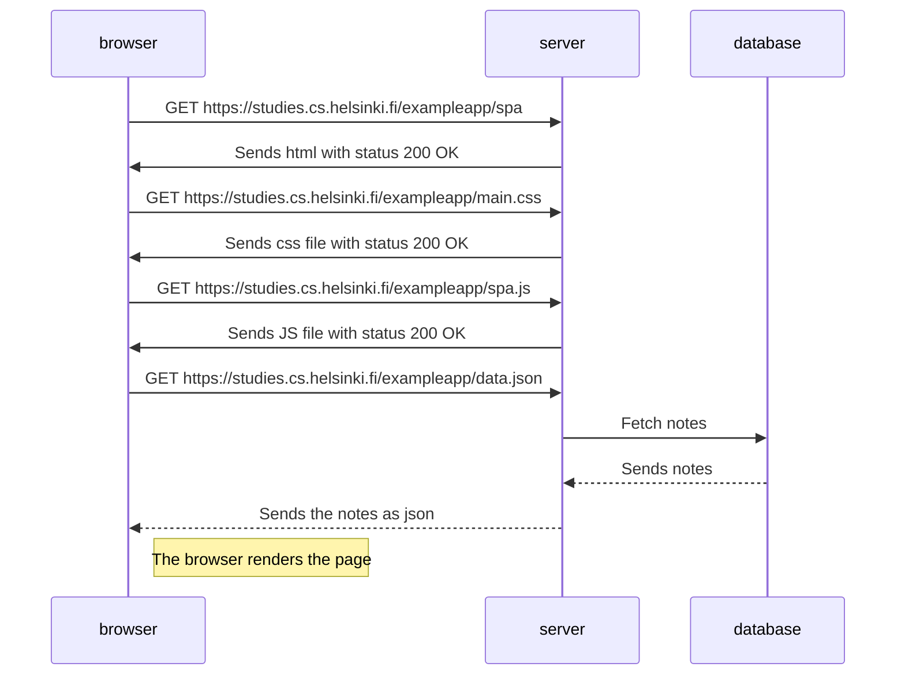

```mermaid
sequenceDiagram
    participant browser
    participant server
    participant database

    browser->>server: GET https://studies.cs.helsinki.fi/exampleapp/spa
    server->>browser: Sends html with status 200 OK

    browser->>server: GET https://studies.cs.helsinki.fi/exampleapp/main.css
    server->>browser: Sends css file with status 200 OK

    browser->>server: GET https://studies.cs.helsinki.fi/exampleapp/spa.js
    server->>browser: Sends JS file with status 200 OK

    browser->>server: GET https://studies.cs.helsinki.fi/exampleapp/data.json
    server->>database: Fetch notes
    database-->>server: Sends notes
    server-->>browser: Sends the notes as json

    Note right of browser: The browser renders the page
```
